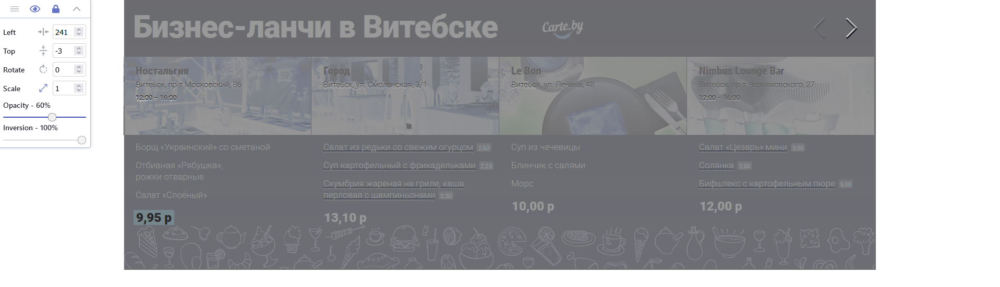

# Тестовое задание "Carte Banner"
## Файловая структура
- `components` - папка содержащая компоненты виджета
   - `carteBanner.js` - Блок Баннера
   - `navigation.js` - Блок стрелок навигации
   - `restaurantCard.js` - карточка заведения
   - `slider.js` - Компонент слайдера, логика слайдера
- `data` - внутри index.json файл содержащий в себе данные для виджета
- `images` - локальные картинки (Все SVG взяты с сайта vitebsk.biz), картинки для заведений являются url на исходник на сервере
- ~~`scss` - исходники стилей и миксины для реализации адаптивной верстки~~ - удалено
- `styles` - содержит в себе reboot.css и скомпилированные css файлы
   - `c-banner.css` - Стили баннера
   - `navigation.css` - Стили для блока навигации
   - `restaurant-item.css` - Стили для карточки заведения
   - `slider.css` - Стили для слайдера
- `index.html`
- `parseVitebskBiz.js` - хелпер, чтобы стянуть данные с vitebsk.biz и не переносить их вручную
- `README.md` - вы здесь

## Запуск
Запустить проект можно через localServer или VS Code Extension "Live Server"

## Функционал
 - Сделан адаптив от мобильной до пк версии
 - Слайдер работает + анимация заднего фона
 - Ссылки на заведения
 - Ховер эффекты
 - Верстка Pixel-Perfect 

## Затраченное время
 - ~ 4 часа  - изучение документации VueJS
 - ~ 2 часа на логику и рендер компонентов
 - ~ 3 часа верстка и стили
 - ~ 2.5 часа реализация слайдера и адаптивности для элементов в области прокрутки

# UPD
- Внесены исправления в соответствии с требованиями
- Верстка разбита на компоненты
- Убран SCSS, медиа-запросы на css
- Стили разбиты на отдельные файлы
- Все вычисляемые значения перенесены в computed
- Рефакторинг кода
